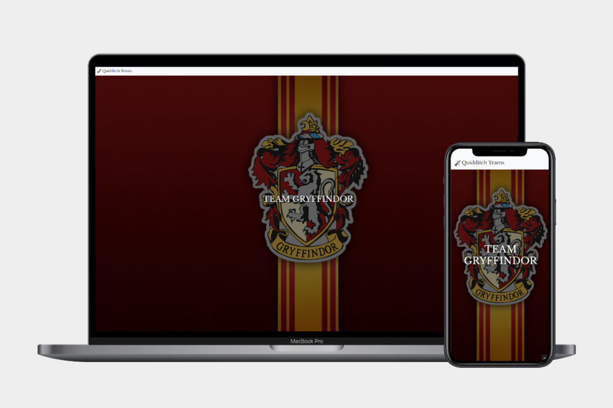
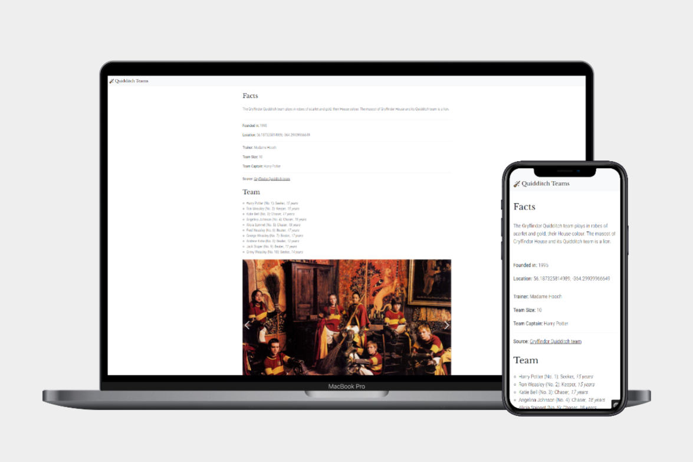

# Pimcore Challenge

## Project Description 
This repository contains the source code for a web application built using Pimcore, a leading open-source content management system (CMS) and product information management (PIM) platform. The web application provides an overview of various quidditch teams, allowing users to view detailed facts about each team on their respective detail pages.
See the challenge description bellow if you want to repeat the challenge.

## Project Features

- Overview page: The web application displays a list of quidditch teams, providing users with an overview of all the available teams.
- Detail page: Users can click on a team from the overview page to view more detailed information about that particular team. The detail page includes facts such as team name players, coaches, achievements, and other relevant information.
- Data management with Pimcore: The web application uses Pimcore's PIM capabilities to manage and store team data, such as team names, players, coaches, and images, etc.
- CLI Command for data import: The repository includes a CLI command that leverages Pimcore's API to import quidditch team data from Excel files into the Pimcore PIM.

## Challenge Description

Create a simple web application that lists 5-10 football teams.
Each team should have the following information:

- Team name
- Club logo
- Coach
- Players (Name, Number, Age, Position)
- Location/City with coordinates
- Year of club establishment
- (any other information you can think of)

For each team, there should be a detail page accessible from an entry list. The list should contain general information (team name, logo, number of players), and the detail page should display all information about the club, including the list of players.

## Useful links

- Pimcore Documentation: Pimcore 
- Pimcore Installation - System Requirements: Installation - Pimcore 
- Pimcore Installation Guide: Installation and Upgrade - Pimcore 
- Pimcore Skeleton for local installation: GitHub - pimcore/skeleton: The Pimcore Skeleton - The right package to get your Pimcore project started from the ground up! 💪